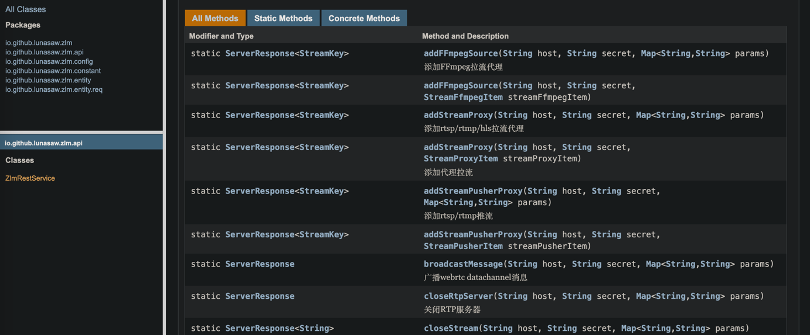

# zlm-spring-boot-starter

[](https://mvnrepository.com/artifact/io.github.lunasaw/zlm-spring-boot-starter)
[](https://raw.githubusercontent.com/lunasaw/zlm-spring-boot-starter/master/LICENSE)

[www.isluna.ml](http://lunasaw.github.io)

ZLMediaKit的spring-boot starter, 对[ZLMediaKit](https://github.com/ZLMediaKit/ZLMediaKit)的API进行了封装，方便使用。支持集群化管理。

[文档链接](https://github.com/lunasaw/zlm-spring-boot-starter/blob/master/zlm-api.md) [API文档](https://lunasaw.github.io/zlm-spring-boot-starter/)

### 快速开始

Hook接口使用类似io.github.lunasaw.zlm.service.LocalZlmHookService，实现ZlmHookService接口，重写方法，即可实现对ZLM的管理，或者继承AbstractZlmHookService，重写需要的方法
**默认实现了ZlmHookService接口的所有方法，均为放通默认返回，可以根据需要重写**


> 

普通api接口使用直接静态方法调用io.github.lunasaw.zlm.api.ZlmRestService

> 

```yaml

> 引入spring-boot-starter

```xml

<dependency>
    <groupId>io.github.lunasaw</groupId>
    <artifactId>zlm-spring-boot-starter</artifactId>
    <version>${last.version}</version>
</dependency>
```

# 代码规范

- 后端使用同一份代码格式化膜模板ali-code-style.xml，ecplise直接导入使用，idea使用Eclipse Code Formatter插件配置xml后使用。
- 前端代码使用vs插件的Beautify格式化，缩进使用TAB
- 后端代码非特殊情况准守P3C插件规范
- 注释要尽可能完整明晰，提交的代码必须要先格式化
- xml文件和前端一样，使用TAB缩进
